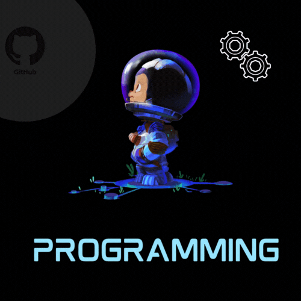

<!-- GitHub Star link -->

  

  <!-- Typing SVG by DenverCoder1 - https://github.com/DenverCoder1/readme-typing-svg -->
  

<h1 align = "center">
  Hey I'm Piumi Dissanayake
  
</h1>

  <a href="your-linkedin-URL">
  
  <a href="your-youtube-URL">
  
  

  

### Glad to see you here! &nbsp; 

👋Hey! Piumi here, a final year BSc(Horns) Software engineering student. Meanwhile, I have completed in Bachelor of English language and Teaching and graduated in Teaching.👩‍🎓

✅ I am an energetic, hardworking individual, a good listener, good at self-learning, building relationships with others, sharing knowledge with others, and good at problem-solving. And a person who will motivate and encourage anyone to succeed in their life. I always look at the brighter side of life and try my best to work my level best to achieve organizational objectives.📚

✅ In my free time, I like to learn about new technologies, listen to motivational speeches, and do some research in different areas. I am good at machine learning, Software engineering, mobile application development, programming, and computer science.👩‍💻

Feel free to connect with me @chinthanipiumi2001 for all things tech or just to say hello! Let's shape the future of tech together. 🌟

Joined Github **3** years ago.

Since then I pushed **326**+ commits, opened **229**+ issues, submitted **100**+ pull requests, created **10**+ gists and contributed to **7**+ public repositories.

📌️skills for learning,💻📚📈

Python 
MATLAB 
java  
C#.net  
C Programming  and C++ 
MY SQL / Oracle/ Microsoft SQL server  
React Js  
HTML / CSS 
PHP  
Java Script/node js  

📌️Mobile development - Android ( java, kotlin)
                                      Flutter (Dart) 
📌️UI / UX - Figma tools 
📌️Linux  
📌️3D web design - Bender  
📌️ Fulstack Development  
📌️Tools - Spring boot, Django, flask, SQLite, firebase, tenser flow, MongoDB, Ajax, Scala, OpenCV  

### Talking about Personal Stuff:
- 🛠 &nbsp; I’m currently working with mobile development,front end and backend development,UI/UX design etc.
- 🚀 &nbsp; I’m currently exploring python,Java,C#.net etc.
- 💬 &nbsp; Ask me anything [here](https://github.com/chinthanipiumi2001)! I am happy to help.
- 👾 &nbsp; Fun fact: Equal is Not Always Equal in JS.
- 📫 &nbsp; Reach me out: chinthani.diss053@gmail.com 

### My Absolute Favorites:

- 💻 &nbsp; I love exploring new technologies and building cool stuff.
- 📰 &nbsp; Reading, writing & watching Tech Stuff whenever possible.
- 🍕 &nbsp; Meetups & Tech Events & Hackathons.

- 🧑‍💻 Tech I work on :

       
      
      
      
       
      
      
      
      
      
      
              
                                      

  

   
  
 

<!--  -->

 
<h3 align="left">💻 GitHub Profile Stats</h3>

 
 

<h3 align="center">A passionate frontend developer from Sri Lanka</h3>

  

    

<h2>🏷️ Holopin Badges</h2>

### Show some ❤️ by starring some of the repositories!

